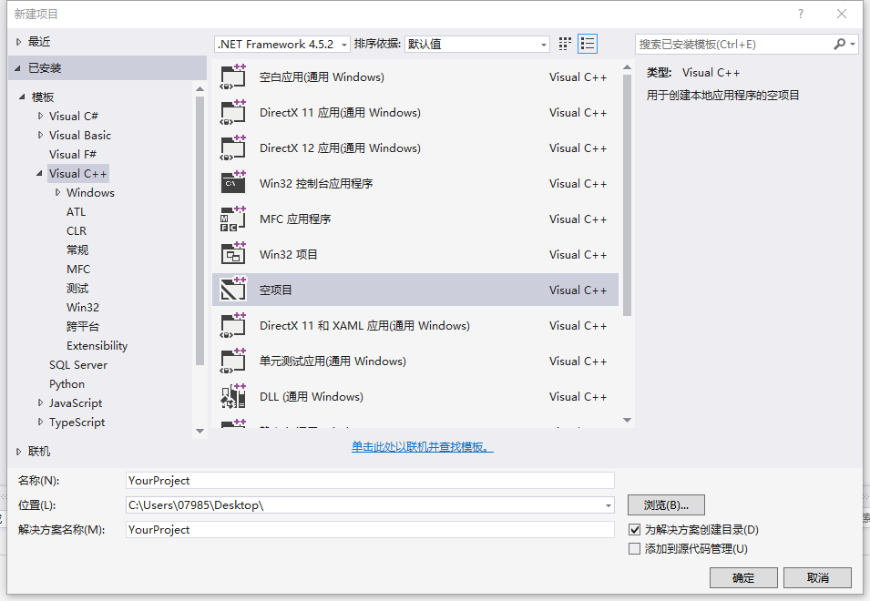
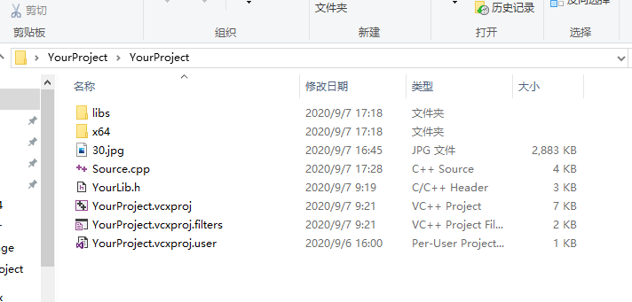
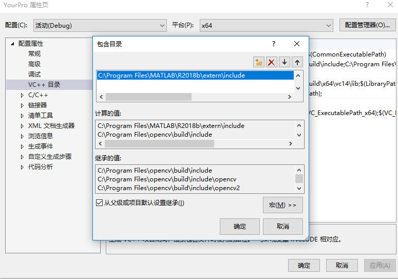
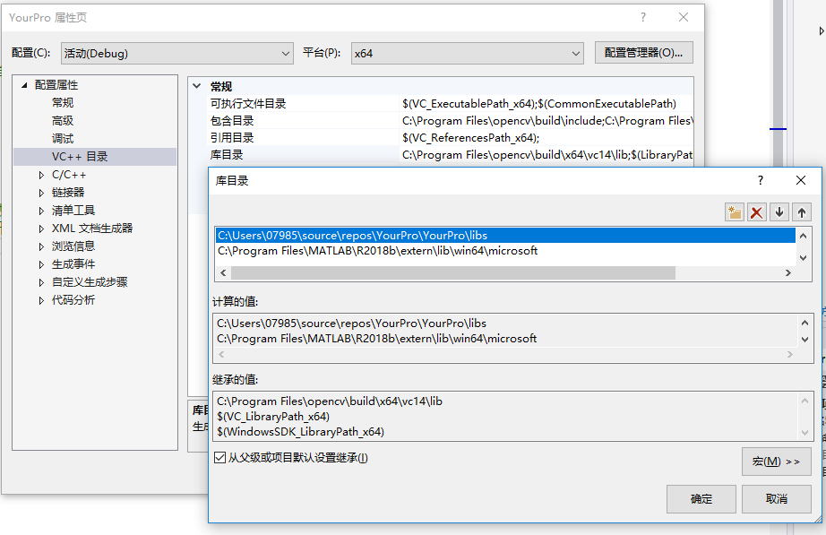
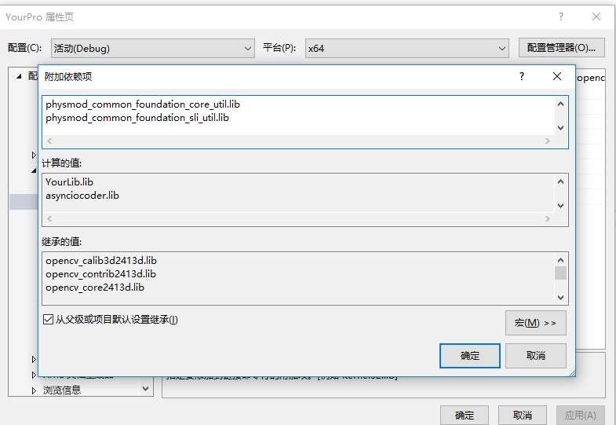
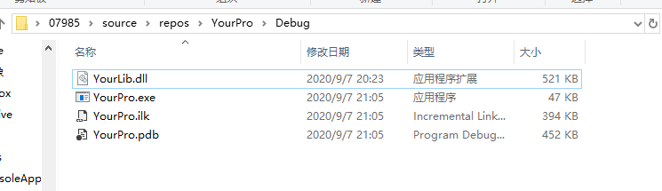

Vs2015配合matlab2018及opencv设置
=============================
matlab 生成dll库文件给vs2015调用。两者配置。

****


# matlab 初始配置
MATLAB2018自带的配置文件无法查找到VS2019（MATLAB2018先发布，当然找不到VS2019），但是我们可以通过修改配置文件的方式让其能够支持VS2019(貌似MATLAB2016及以上的版本都可以)。

将 `VS2019支持配置文件`放到`S:\MATLAB\R2018b\bin\win64\mexopts`中（根据自己的安装位置修改）。

按下 `win+r`，输入 `regedit`打开注册表编辑器，找到 `计算机\HKEY_LOCAL_MACHINE\SOFTWARE\WOW6432Node\Microsoft\VisualStudio\SxS\VS7`

在其中先讲一个字符串值，数据按自己的VS安装目录修改。

名称：16.0
数据：


# matlab生成`.dll` `.h` `.lib`

* 新建matlab 工作文件夹workplace

* matlab 当前路径确保切换到workplace，新建函数sfrmat5.m

* 命令行输入
```matlab
 mcc -W cpplib:YourLib -T link:lib sfrmat5.m
 % `YourLib` 是生成的库文件名称。 `sfrmat5.m`为要编译的matlab函数。
```
      

* workplace文件夹下生成的文件中要用到`.dll`、`.h`、`.lib`文件。

# vs2015配置

  **新建工程**


 


 **将matlab 生成的`.h`文件移动到与cpp文件同一个文件夹。并在该文件夹新建libs文件夹，并将生成的lib移动到该文件夹。**




**在vs界面添加上一步生成的头文件**


**工程---性,添加`matlab`包含目录。**



**添加库目录，包含matlab目录与上一步我们创建的目标**


**将`C:\Program Files\MATLAB\R2018b\extern\lib\win64\mingw64`下的文件名与matlab生成的lib名添加到链接器，输入**


**vs 生成。将matlab生成的`dll`文件移动到`exe`一个文件夹下**




* main函数初始化与结束
```c
int main()
{

	// matlab 初始化
	printf("Initia Application\n");
	if (!mclInitializeApplication(NULL, 0))
	{
		printf("Failed");
		_getch();
		return -1;
	}
	else
	{
		printf("Done\n");
	}
	printf("InitiaLi LIbra...");

	if (!YourLibInitialize())
	{
		printf("Failed");
		_getch();
		return -1;
	}
	else
	{
		printf("Done\n");
	}


	// main code 
	/*读入图片*/
	Mat src, src_gray;
	src = imread("30.jpg", 1);
	//imshow("orange", src);
	if (!src.data)
	{
		cout << "fail to load image!" << endl;
	}

	if (!src.data)
	{
		return -1;
	}


	//matlab 调用结束
	printf("terminating Library...");
	YourLibTerminate();
	printf("Done \n");


	printf("Termi  Application");
	if (!mclTerminateApplication())
	{
		printf("Failed !");
		_getch();
		return -1;
	}
	else
	{
		printf("Done\n");
	}

	printf("\nPredd any key to continue ..");
	_getch;
	system("pause");


	return 0;

}
````

*  参考
https://www.youtube.com/watch?v=DWzpBEGrMs4&list=LL&index=1&t=450s

********************
#  opencv 设置